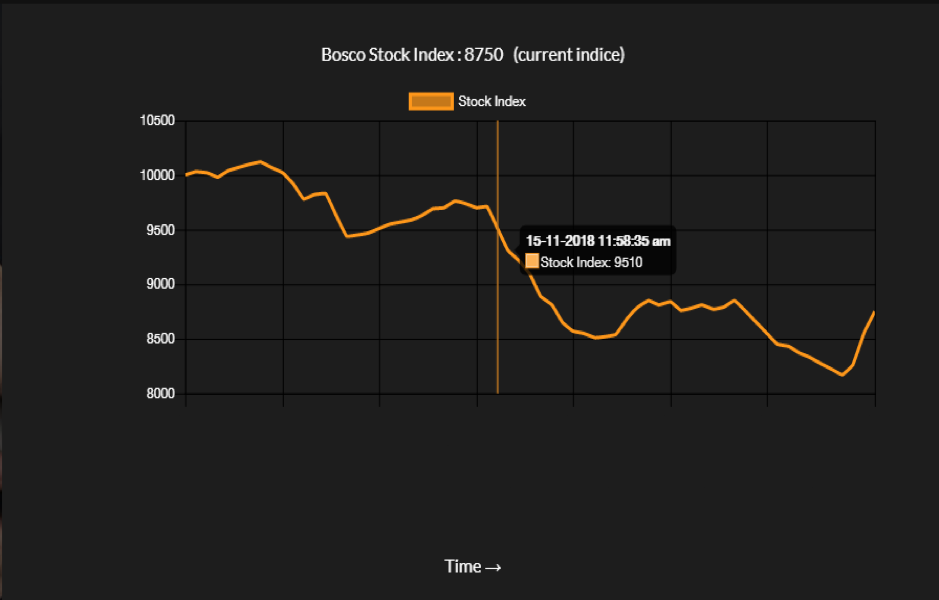
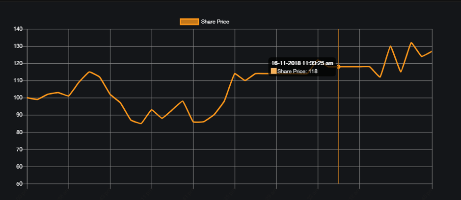
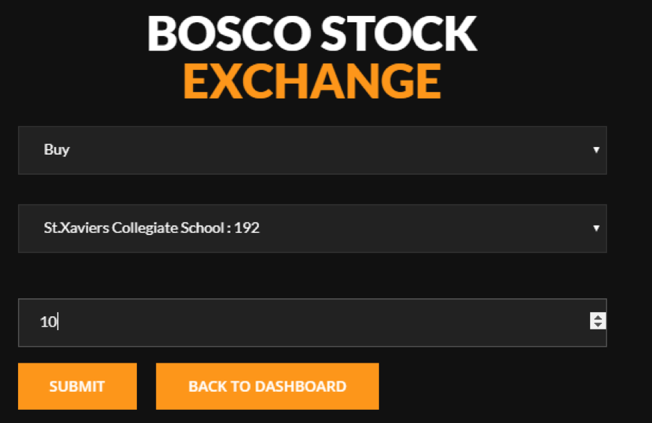
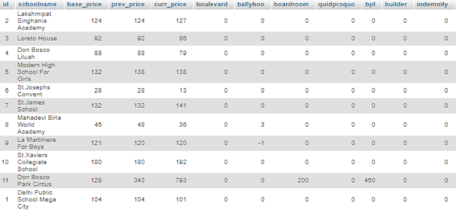

# stock-simulator
This is a customizable stock simulator with graphs, charts, trading portal, cumulative stock index and a fixed deposit feature. 
It was built in August 2018, for a school stock-exchange competition. Uses **JavaScript** and **Ajax** for displaying reactive charts, **PHP** for routing forms and data, and **MySQL** as an RDBMS. You can check out the full documentation [here](https://drive.google.com/drive/folders/12ObKKHioXFmHKC7UD4_BKSotKDg-XKTy?usp=sharing "Drive Documentation")

Snippet Images of the Website
------

**1. Home Page**

**2. Stock Charts**

**3. Investor's Trading Portal**

**4. MySQL Database**

